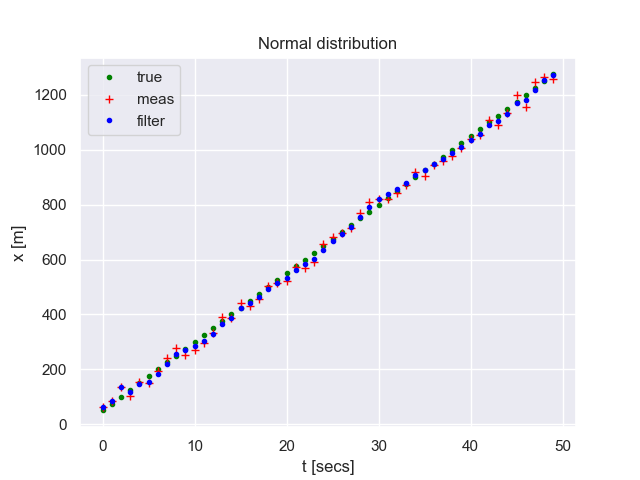
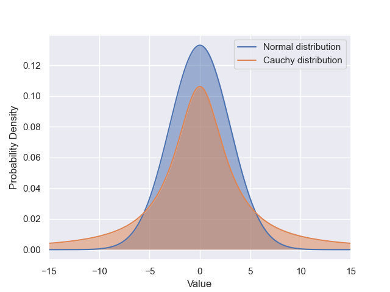

Alpha-beta filter
==============================

Python implementation of the alpha-beta filter
------------------------------

The situation under consideration: 

We have a sensor for measuring the coordinate of a location. The problem is that the data comes with an error (noise). To solve this problem, it is necessary to apply a filtering algorithm (alpha-beta filter). We assume that the noise follows a normal distribution, and the sensor's coordinate change primarily occurs linearly.

[View IPython Notebook](https://github.com/Omazz/alpha-beta-filter/blob/main/ab-filter.ipynb)

About the noise characteristics of the input data
------------------------------

The situation under consideration: 

What will happen if the noise additive does not obey the law of normal distribution? In the real world this happens quite often. Typically, the noise probability density function is indeed similar to the normal distribution, but has a large number of outliers. This corresponds to the Cauchy distribution.

[View IPython Notebook](https://github.com/Omazz/alpha-beta-filter/blob/main/noise.ipynb)